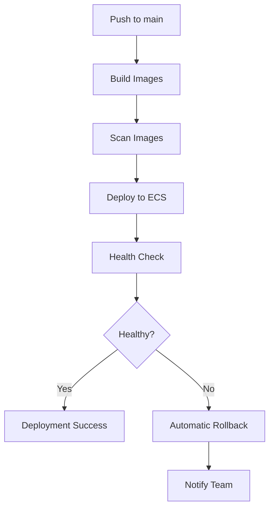

# Infrastructure Documentation

This document describes the AWS infrastructure setup for Party Puzzle Palooza staging environment.

## 🏗️ Architecture Overview

The infrastructure is built using Terraform and consists of the following components:

```
┌─────────────────┐    ┌─────────────────┐    ┌─────────────────┐
│   Internet      │    │   Application   │    │   ECS Fargate   │
│   Gateway       │    │   Load Balancer │    │   Cluster       │
└─────────────────┘    └─────────────────┘    └─────────────────┘
         │                       │                       │
         │                       │                       │
         ▼                       ▼                       ▼
┌─────────────────┐    ┌─────────────────┐    ┌─────────────────┐
│   Public        │    │   Private       │    │   ECR           │
│   Subnets       │    │   Subnets       │    │   Repositories  │
└─────────────────┘    └─────────────────┘    └─────────────────┘
```

## 📦 Infrastructure Components

### 1. VPC and Networking
- **VPC**: Custom VPC with CIDR `10.0.0.0/16`
- **Public Subnets**: 3 subnets across different AZs for ALB
- **Private Subnets**: 3 subnets across different AZs for ECS tasks
- **NAT Gateway**: For private subnet internet access
- **Security Groups**: Separate SG for ALB and ECS tasks

### 2. ECR (Elastic Container Registry)
- **Repositories**:
  - `party-puzzle-palooza-web`: Frontend application
  - `party-puzzle-palooza-api`: Backend API
- **Features**:
  - Image scanning on push
  - Lifecycle policies (keep last 30 images)
  - Repository policies for ECS access

### 3. ECS Fargate
- **Cluster**: `staging-cluster`
- **Services**:
  - `staging-web-service`: Frontend service (2 tasks)
  - `staging-api-service`: Backend service (2 tasks)
- **Features**:
  - Auto-scaling based on CPU/memory
  - Health checks with automatic rollback
  - CloudWatch logging

### 4. Application Load Balancer
- **Type**: Application Load Balancer (ALB)
- **Listeners**:
  - Port 80: HTTP → HTTPS redirect
  - Port 443: HTTPS with SSL termination
- **Routing**:
  - `/api/*` → API service
  - `/health` → API service
  - `/*` → Web service

## 🚀 Deployment Process

### Blue/Green Deployment Strategy

The deployment process follows a blue/green strategy:

1. **Build Phase**: Build and push Docker images to ECR
2. **Scan Phase**: Scan images for vulnerabilities using Trivy
3. **Deploy Phase**: Update ECS services with new task definitions
4. **Health Check Phase**: Verify services are healthy
5. **Rollback Phase**: Automatic rollback on health check failure

### Deployment Workflow



## 🔧 Configuration

### Environment Variables

The following environment variables are required:

```bash
# AWS Configuration
AWS_REGION=us-west-2
AWS_ACCESS_KEY_ID=your-access-key
AWS_SECRET_ACCESS_KEY=your-secret-key
AWS_ACCOUNT_ID=your-account-id

# Application Configuration
NODE_ENV=production
PORT=3001
```

### GitHub Secrets

Configure these secrets in your GitHub repository:

- `AWS_ACCESS_KEY_ID`: AWS access key for deployment
- `AWS_SECRET_ACCESS_KEY`: AWS secret key for deployment
- `AWS_ACCOUNT_ID`: Your AWS account ID

## 📋 Prerequisites

### 1. AWS Account Setup
- AWS account with appropriate permissions
- IAM user with ECR, ECS, and ALB permissions
- S3 bucket for Terraform state (create manually)

### 2. Domain and SSL Certificate
- Domain name for your application
- SSL certificate in AWS Certificate Manager
- Update `certificate_arn` in `terraform/environments/staging/variables.tf`

### 3. S3 Backend Setup
Create an S3 bucket for Terraform state:

```bash
aws s3 mb s3://party-puzzle-palooza-terraform-state
aws s3api put-bucket-versioning \
  --bucket party-puzzle-palooza-terraform-state \
  --versioning-configuration Status=Enabled
```

## 🛠️ Deployment Commands

### Initial Infrastructure Setup

1. **Deploy Infrastructure**:
   ```bash
   cd terraform/environments/staging
   terraform init
   terraform plan
   terraform apply
   ```

2. **Deploy Application**:
   ```bash
   # Push to main branch triggers automatic deployment
   git push origin main
   ```

### Manual Deployment

You can manually trigger deployments from GitHub Actions:

1. Go to Actions → Deploy to Staging
2. Click "Run workflow"
3. Select service (web, api, or both)
4. Click "Run workflow"

### Infrastructure Management

1. **Plan Changes**:
   ```bash
   cd terraform/environments/staging
   terraform plan
   ```

2. **Apply Changes**:
   ```bash
   terraform apply
   ```

3. **Destroy Infrastructure**:
   ```bash
   terraform destroy
   ```

## 🔍 Monitoring and Logging

### CloudWatch Logs
- **Web Service**: `/ecs/staging-web`
- **API Service**: `/ecs/staging-api`
- **ALB Access Logs**: Configured in ALB settings

### Health Checks
- **Web Service**: `GET /` (expects 200)
- **API Service**: `GET /health` (expects 200)
- **Interval**: 30 seconds
- **Timeout**: 5 seconds
- **Unhealthy Threshold**: 3 failures

### Metrics
- ECS service metrics (CPU, memory, network)
- ALB metrics (request count, response time)
- Target group health metrics

## 🔒 Security

### Network Security
- Private subnets for ECS tasks
- Security groups with minimal required access
- HTTPS-only traffic (HTTP redirects to HTTPS)

### Container Security
- Non-root user in containers
- Image vulnerability scanning
- Regular security updates

### Access Control
- IAM roles with least privilege
- ECR repository policies
- ECS task execution roles

## 🚨 Troubleshooting

### Common Issues

1. **Deployment Failures**:
   - Check ECS service events
   - Verify task definition
   - Check container logs in CloudWatch

2. **Health Check Failures**:
   - Verify application is listening on correct port
   - Check health check endpoint returns 200
   - Review security group rules

3. **Image Build Failures**:
   - Check Dockerfile syntax
   - Verify dependencies in package.json
   - Check ECR repository permissions

### Useful Commands

```bash
# Check ECS service status
aws ecs describe-services \
  --cluster staging-cluster \
  --services staging-web-service

# View container logs
aws logs tail /ecs/staging-web --follow

# Check ALB target health
aws elbv2 describe-target-health \
  --target-group-arn <target-group-arn>
```

## 📈 Scaling

### Auto Scaling
ECS services are configured with auto-scaling based on:
- CPU utilization > 70%
- Memory utilization > 70%
- Target tracking scaling policies

### Manual Scaling
```bash
# Scale web service
aws ecs update-service \
  --cluster staging-cluster \
  --service staging-web-service \
  --desired-count 4
```

## 💰 Cost Optimization

### Recommendations
- Use Spot instances for non-critical workloads
- Implement auto-scaling to scale down during low usage
- Monitor and optimize resource allocation
- Use CloudWatch alarms for cost monitoring

### Estimated Costs (us-west-2)
- ECS Fargate: ~$30-50/month
- ALB: ~$20/month
- NAT Gateway: ~$45/month
- ECR: ~$5-10/month
- **Total**: ~$100-125/month

## 🔄 Updates and Maintenance

### Regular Maintenance
- Update base images regularly
- Monitor security advisories
- Review and update IAM policies
- Monitor CloudWatch metrics

### Backup Strategy
- ECR images are versioned
- Terraform state is stored in S3 with versioning
- Application data should be stored in managed services (RDS, S3)

## 📞 Support

For infrastructure issues:
1. Check CloudWatch logs
2. Review ECS service events
3. Verify security group configurations
4. Check ALB target group health
5. Review Terraform state and outputs 